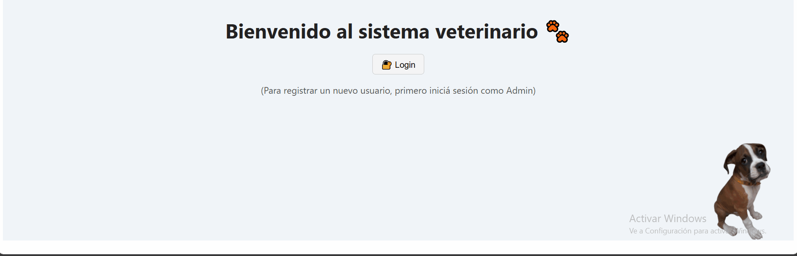
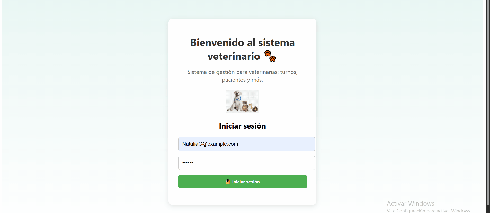

# 🐾 Sistema de Gestión Veterinaria

Proyecto en desarrollo para la gestión integral de una clínica veterinaria.  
Desarrollado con **Angular** (frontend) y **.NET Core** (backend), incluye login con control de roles (**Admin**, **Recepcionista**, **Veterinario**).

---

## 🎯 Funcionalidades principales

- Inicio de sesión (login)
- Cambio de contraseña
- Registro y gestión de clientes y mascotas
- Agenda de turnos
- Historial clínico
- Control de acceso por tipo de usuario (Admin, Recepcionista, Veterinario)
- Diseño responsive

---

## 🖼️ Capturas

### 🏠 Vista Home – Cambio de mascotas por cliente

### 🧑‍💼 Vista Admin

### 📋 Vista Recepcionista

### 🩺 Vista Veterinario

---

## 📋 Autorización – Permisos por rol

| Recurso / Acción            | Admin | Recepcionista | Veterinario |
| --------------------------- | :---: | :-----------: | :---------: |
| **🔐 Autenticación**        |       |               |             |
| Login                       |  ✅   |      ✅       |     ✅      |
| Registro de usuarios        |  ✅   |      🔒       |     🔒      |
| Dashboard (acceso)          |  ✅   |      ✅       |     ✅      |
| Obtener usuarios            |  ✅   |      🔒       |     🔒      |
| Editar usuarios             |  ✅   |      🔒       |     🔒      |
| Eliminar usuarios           |  ✅   |      🔒       |     🔒      |
| Cambiar contraseña          |  ✅   |      ✅       |     ✅      |
| **👥 Clientes**             |       |               |             |
| Obtener clientes            |  ✅   |      ✅       |     ✅      |
| Agregar cliente             |  ✅   |      ✅       |     🔒      |
| Editar cliente              |  ✅   |      ✅       |     🔒      |
| Eliminar cliente            |  ✅   |      🔒       |     🔒      |
| **📄 Historial Clínico**    |       |               |             |
| Ver historial clínico       |  ✅   |      ✅       |     ✅      |
| Crear historial clínico     |  ✅   |      🔒       |     ✅      |
| **📆 Turnos**               |       |               |             |
| Obtener turnos              |  ✅   |      ✅       |     ✅      |
| Crear turno                 |  ✅   |      ✅       |     🔒      |
| Editar turno                |  ✅   |      ✅       |     ✅      |
| Eliminar turno              |  ✅   |      🔒       |     🔒      |
| **🐾 Pacientes (Mascotas)** |       |               |             |
| Obtener pacientes           |  ✅   |      ✅       |     ✅      |
| Crear paciente              |  ✅   |      ✅       |     ✅      |
| Editar paciente             |  ✅   |      ✅       |     ✅      |
| Eliminar paciente           |  ✅   |      🔒       |     🔒      |

---

## 🧪 Demo

🔗 Accedé a la demo funcionando acá:
https://veterinaria-frontend-74k3.onrender.com

🧑‍💼 Usuario de prueba (Admin)

Usuario: admin@gmail.com

Contraseña: admin123

---

## 🛠️ Tecnologías

- Angular
- .NET Core
- Entity Framework
- PostgreSQL
